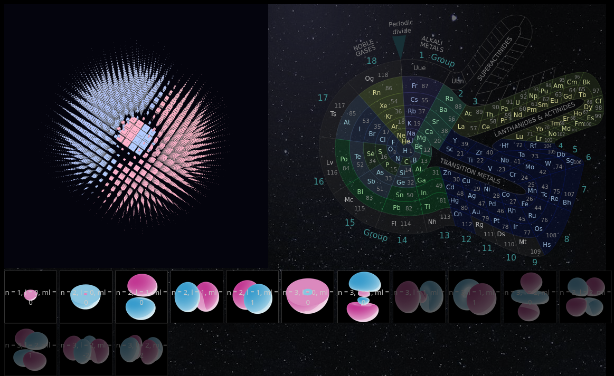

# 3D Atomic Orbital viewer

#### Description:
This is an [atomic orbitals](https://en.wikipedia.org/wiki/Atomic_orbital) plotter, that draws the orbits of the electrons of atoms in 3D.
Just select one of the first 30 atoms from the spiral periodic table and the most representative orbit for that atom will be displayed in 3D.
Usually, the most representative orbit is the last (highest energy) orbit.

### Technologies used:
* HTML, CSS
* Javascript
* [Babylon.js](https://www.babylonjs.com/) library for 3D rendering

### How to run
Just download the project and open the index.html file in a browser. No web server or compilation required, but an internet connection is required, because the Babylon.js 3D rendering library is not included in the project, it's loaded from a CDN, when the main page is loaded.

### License
The source code is licensed under the MIT license.

### Image credits
This project uses 3rd party images:
* 2D pictures of orbitals: [Wikipedia](https://en.wikipedia.org/wiki/Atomic_orbital#Orbitals_table)
* The Theodore Benfey spiral periodic table image is a modified version of an [Wikimedia](https://commons.wikimedia.org/wiki/File:Elementspiral_(polyatomic).svg) image and is licensed under Creative Commons By-SA 3.0 (same as original).
* The star space background is: [Photo by Kai Pilger](https://www.pexels.com/photo/cluster-of-stars-1341279/), taken from [pexels.com](https://www.pexels.com/).

There is an "image credits" link in the main page (index.html) of this project, that offers more details about the images and their atribution or license.